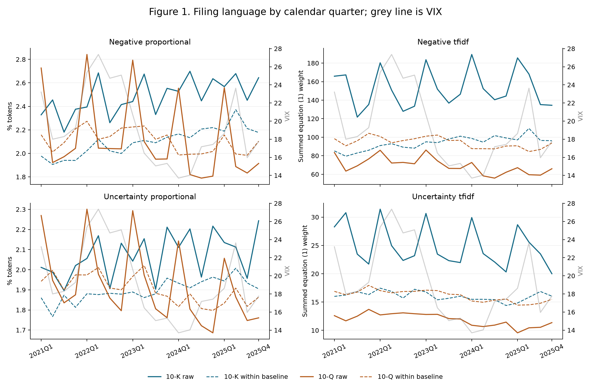

# Assignment 1 report

Jonas Wu (jw9452) | FRE-GY 7871 A | Assignment 1 | September 2026

**Abstract.** I study negative language and uncertainty in 1,002 SEC filings from 60 ARK portfolio firms during 2021-2025. Within-firm weighted uncertainty declines, and controlling for prior volatility reduces the association between uncertainty and subsequent volatility. Filing-return estimates remain inconclusive. Company comparisons separate annual and quarterly reports: high language shares and high cumulative word counts identify different firms. These retrospective associations depend on the retained sample and do not establish causation or trading performance.

## 1. Sample and research question

I examine negative language and uncertainty in 1,002 SEC filings from 60 firms. The sample includes 248 annual reports and 754 quarterly reports filed in 2021-2025. I test changes in language within firms, the association between uncertainty and subsequent volatility, and the association between negative tone and four-day filing returns.

I start with all 226 positions in the six-fund snapshot, covering 130 distinct security records. I match the original ticker, security identifier and issuer name to reviewed SEC identities. Airbus (AIR) remains separate from AAR; Discovery (DSY) remains separate from Dassault Systemes (DSY FP). Neither foreign DSY holding maps to the US-listed Big Tree Cloud. The appendix lists each excluded security.

### Table 1. Holding reconciliation and filing filters

<table border="1" class="dataframe">
  <thead>
    <tr style="text-align: right;">
      <th>Holding disposition</th>
      <th>Securities</th>
    </tr>
  </thead>
  <tbody>
    <tr>
      <td>Fund holdings</td>
      <td>4</td>
    </tr>
    <tr>
      <td>No verified SEC issuer match</td>
      <td>3</td>
    </tr>
    <tr>
      <td>Verified issuer, no 2021-2025 10-K/10-Q</td>
      <td>31</td>
    </tr>
    <tr>
      <td>Eligible listings</td>
      <td>92</td>
    </tr>
  </tbody>
</table>

The 92 eligible listings represent 91 issuers; GOOG and GOOGL share a CIK. The filing waterfall counts listing records before accession deduplication. I report missing prices before the USD 3 screen.

<table border="1" class="dataframe">
  <thead>
    <tr style="text-align: right;">
      <th>Retained condition</th>
      <th>Remaining</th>
      <th>Removed</th>
    </tr>
  </thead>
  <tbody>
    <tr>
      <td>Eligible SEC filings in 2021-2025</td>
      <td>1683</td>
      <td>0</td>
    </tr>
    <tr>
      <td>Downloaded and parsed</td>
      <td>1683</td>
      <td>0</td>
    </tr>
    <tr>
      <td>Unique accession</td>
      <td>1663</td>
      <td>20</td>
    </tr>
    <tr>
      <td>Required forms and filing dates</td>
      <td>1663</td>
      <td>0</td>
    </tr>
    <tr>
      <td>At least 2,000 parsed tokens (both forms)</td>
      <td>1663</td>
      <td>0</td>
    </tr>
    <tr>
      <td>Observed acceptance and tradable day 0</td>
      <td>1663</td>
      <td>0</td>
    </tr>
    <tr>
      <td>Unambiguous exact-filing cover-page shares</td>
      <td>1070</td>
      <td>593</td>
    </tr>
    <tr>
      <td>Observed unadjusted previous-session close</td>
      <td>1053</td>
      <td>17</td>
    </tr>
    <tr>
      <td>Unadjusted previous-session close at least USD 3</td>
      <td>1007</td>
      <td>46</td>
    </tr>
    <tr>
      <td>Complete four-day stock and SPY returns</td>
      <td>1007</td>
      <td>0</td>
    </tr>
    <tr>
      <td>Complete 55-day pre-filing return window</td>
      <td>1002</td>
      <td>5</td>
    </tr>
    <tr>
      <td>Complete 63-day post-filing return window</td>
      <td>1002</td>
      <td>0</td>
    </tr>
    <tr>
      <td>Complete positive pre-filing volume control</td>
      <td>1002</td>
      <td>0</td>
    </tr>
    <tr>
      <td>Finite size and turnover controls</td>
      <td>1002</td>
      <td>0</td>
    </tr>
  </tbody>
</table>

The 2,000-token and USD 3 thresholds are research choices. I require a common complete-case sample so the paired regressions use the same observations and the same IDF corpus.

## 2. Language measures

I use the Loughran-McDonald financial dictionary: 2,355 negative words and 297 uncertainty words, with 40 in both lists. Negative tone describes adverse outcomes; uncertainty describes qualifications and indeterminacy. A financial dictionary avoids the broad negative labels that general-purpose lists assign to ordinary accounting language.

### Table 2. Summary statistics by report type

<table border="1" class="dataframe">
  <thead>
    <tr style="text-align: right;">
      <th>Form</th>
      <th>Measure</th>
      <th>N</th>
      <th>Mean</th>
      <th>SD</th>
      <th>25%</th>
      <th>50%</th>
      <th>75%</th>
    </tr>
  </thead>
  <tbody>
    <tr>
      <td>10-K</td>
      <td>Neg-P</td>
      <td>248</td>
      <td>0.024664</td>
      <td>0.0037473</td>
      <td>0.021925</td>
      <td>0.024975</td>
      <td>0.027374</td>
    </tr>
    <tr>
      <td>10-K</td>
      <td>Neg-T</td>
      <td>248</td>
      <td>175.66</td>
      <td>67.835</td>
      <td>124.25</td>
      <td>153.61</td>
      <td>224.36</td>
    </tr>
    <tr>
      <td>10-K</td>
      <td>Unc-P</td>
      <td>248</td>
      <td>0.020802</td>
      <td>0.0025528</td>
      <td>0.019074</td>
      <td>0.020975</td>
      <td>0.02265</td>
    </tr>
    <tr>
      <td>10-K</td>
      <td>Unc-T</td>
      <td>248</td>
      <td>28.752</td>
      <td>9.7703</td>
      <td>21.383</td>
      <td>26.462</td>
      <td>34.147</td>
    </tr>
    <tr>
      <td>10-Q</td>
      <td>Neg-P</td>
      <td>754</td>
      <td>0.019708</td>
      <td>0.0096134</td>
      <td>0.011775</td>
      <td>0.016103</td>
      <td>0.028734</td>
    </tr>
    <tr>
      <td>10-Q</td>
      <td>Neg-T</td>
      <td>754</td>
      <td>66.58</td>
      <td>71.101</td>
      <td>17.463</td>
      <td>30.267</td>
      <td>104.98</td>
    </tr>
    <tr>
      <td>10-Q</td>
      <td>Unc-P</td>
      <td>754</td>
      <td>0.018423</td>
      <td>0.0064409</td>
      <td>0.013688</td>
      <td>0.016603</td>
      <td>0.024028</td>
    </tr>
    <tr>
      <td>10-Q</td>
      <td>Unc-T</td>
      <td>754</td>
      <td>11.906</td>
      <td>8.4644</td>
      <td>5.6687</td>
      <td>9.3335</td>
      <td>14.893</td>
    </tr>
  </tbody>
</table>

P denotes the fraction of tokens in the category; T denotes the summed tf.idf weight. Neg is negative language and Unc is uncertainty. The notebook includes minima, maxima and the correlation matrix.

The negative/uncertainty proportion correlation is 0.736 for 10-K; 0.903 for 10-Q.

### Table 3. Thirty most frequent words in each list

<table border="1" class="dataframe">
  <thead>
    <tr style="text-align: right;">
      <th>Rank</th>
      <th>Negative word</th>
      <th>% of Neg</th>
      <th>Uncertainty word</th>
      <th>% of Unc</th>
    </tr>
  </thead>
  <tbody>
    <tr>
      <td>1</td>
      <td>LOSS</td>
      <td>4.8917</td>
      <td>MAY</td>
      <td>37.026</td>
    </tr>
    <tr>
      <td>2</td>
      <td>ADVERSELY</td>
      <td>4.0256</td>
      <td>COULD</td>
      <td>19.45</td>
    </tr>
    <tr>
      <td>3</td>
      <td>ADVERSE</td>
      <td>3.2851</td>
      <td>RISK</td>
      <td>5.6754</td>
    </tr>
    <tr>
      <td>4</td>
      <td>CLAIMS</td>
      <td>2.7511</td>
      <td>RISKS</td>
      <td>5.0246</td>
    </tr>
    <tr>
      <td>5</td>
      <td>AGAINST</td>
      <td>2.1977</td>
      <td>BELIEVE</td>
      <td>2.9288</td>
    </tr>
    <tr>
      <td>6</td>
      <td>UNABLE</td>
      <td>2.1675</td>
      <td>APPROXIMATELY</td>
      <td>2.1891</td>
    </tr>
    <tr>
      <td>7</td>
      <td>LOSSES</td>
      <td>2.0831</td>
      <td>ASSUMPTIONS</td>
      <td>1.4962</td>
    </tr>
    <tr>
      <td>8</td>
      <td>FAILURE</td>
      <td>2.0224</td>
      <td>UNCERTAINTIES</td>
      <td>1.2329</td>
    </tr>
    <tr>
      <td>9</td>
      <td>HARM</td>
      <td>1.8111</td>
      <td>FLUCTUATIONS</td>
      <td>1.2118</td>
    </tr>
    <tr>
      <td>10</td>
      <td>LITIGATION</td>
      <td>1.7114</td>
      <td>ANTICIPATED</td>
      <td>1.0839</td>
    </tr>
    <tr>
      <td>11</td>
      <td>CRITICAL</td>
      <td>1.379</td>
      <td>INTANGIBLE</td>
      <td>1.0732</td>
    </tr>
    <tr>
      <td>12</td>
      <td>FAIL</td>
      <td>1.3696</td>
      <td>POSSIBLE</td>
      <td>1.0671</td>
    </tr>
    <tr>
      <td>13</td>
      <td>NEGATIVELY</td>
      <td>1.3631</td>
      <td>DEPEND</td>
      <td>1.0445</td>
    </tr>
    <tr>
      <td>14</td>
      <td>DELAYS</td>
      <td>1.3065</td>
      <td>PREDICT</td>
      <td>1.0141</td>
    </tr>
    <tr>
      <td>15</td>
      <td>DELAY</td>
      <td>1.1822</td>
      <td>UNCERTAIN</td>
      <td>0.96068</td>
    </tr>
    <tr>
      <td>16</td>
      <td>DIFFICULT</td>
      <td>1.1437</td>
      <td>UNCERTAINTY</td>
      <td>0.92253</td>
    </tr>
    <tr>
      <td>17</td>
      <td>PENALTIES</td>
      <td>1.1094</td>
      <td>ANTICIPATE</td>
      <td>0.91125</td>
    </tr>
    <tr>
      <td>18</td>
      <td>NEGATIVE</td>
      <td>1.0389</td>
      <td>MIGHT</td>
      <td>0.77943</td>
    </tr>
    <tr>
      <td>19</td>
      <td>DECLINE</td>
      <td>0.87854</td>
      <td>DIFFER</td>
      <td>0.77854</td>
    </tr>
    <tr>
      <td>20</td>
      <td>IMPAIRMENT</td>
      <td>0.86998</td>
      <td>VOLATILITY</td>
      <td>0.74254</td>
    </tr>
    <tr>
      <td>21</td>
      <td>CHALLENGES</td>
      <td>0.85316</td>
      <td>DEPENDS</td>
      <td>0.69221</td>
    </tr>
    <tr>
      <td>22</td>
      <td>DISRUPTIONS</td>
      <td>0.84827</td>
      <td>EXPOSURE</td>
      <td>0.65066</td>
    </tr>
    <tr>
      <td>23</td>
      <td>LIMITATIONS</td>
      <td>0.78757</td>
      <td>DEPENDENT</td>
      <td>0.61717</td>
    </tr>
    <tr>
      <td>24</td>
      <td>RESTATED</td>
      <td>0.78374</td>
      <td>PENDING</td>
      <td>0.60159</td>
    </tr>
    <tr>
      <td>25</td>
      <td>FINES</td>
      <td>0.70454</td>
      <td>VARY</td>
      <td>0.50935</td>
    </tr>
    <tr>
      <td>26</td>
      <td>DAMAGES</td>
      <td>0.68818</td>
      <td>CONTINGENT</td>
      <td>0.47515</td>
    </tr>
    <tr>
      <td>27</td>
      <td>HARMED</td>
      <td>0.66387</td>
      <td>FLUCTUATE</td>
      <td>0.46171</td>
    </tr>
    <tr>
      <td>28</td>
      <td>VOLATILITY</td>
      <td>0.63391</td>
      <td>REVISED</td>
      <td>0.45204</td>
    </tr>
    <tr>
      <td>29</td>
      <td>DAMAGE</td>
      <td>0.62932</td>
      <td>CONTINGENCIES</td>
      <td>0.42751</td>
    </tr>
    <tr>
      <td>30</td>
      <td>INABILITY</td>
      <td>0.62641</td>
      <td>DEPENDING</td>
      <td>0.36536</td>
    </tr>
  </tbody>
</table>

The top 30 words account for 45.81% of negative occurrences and 91.87% of uncertainty occurrences. MAY alone accounts for 37.03% of uncertainty words. I use all category occurrences as the denominator. Common hedges dominate the proportions, which motivates the tf.idf comparison.

## 3. Measurement and quarterly composition

I retain the starter parser: it removes inline-XBRL elements, hidden content and tables with digits exceeding 15% of non-space characters. It produces uppercase tokens of at least two letters, allowing internal apostrophes and hyphens. I analyse the resulting whole-document text. The parser can remove narrative inside XBRL tags and leave boilerplate; the scores inherit these measurement limits.

Proportional tone is category word occurrences divided by total tokens. For each observed term, equation (1) of Loughran and McDonald gives [(1 + ln tf)/(1 + ln a)] ln(N/df), where a is total tokens divided by distinct observed tokens in that filing. I sum these weights within each category. N and df use the final regression corpus. This full-sample construction contains future corpus information, so I interpret the tests as retrospective associations.

### Figure 1. Quarterly language and VIX

I average multiple filings within each firm-form-quarter, giving 1,000 cells from 1,002 filings, and then give each cell equal weight. Solid lines separate 10-Ks and 10-Qs. For the dashed lines I subtract each firm-form mean and add the pooled mean; these lines describe baseline composition in an unbalanced panel. I use fixed effects in Table 4 for the trend test. The grey right-axis series is the quarterly mean VIX.

Annual reports cluster in particular quarters and contain more risk discussion. Firms also differ in their baseline language. I therefore separate report types and include quarter-of-year controls in both aggregate and within-firm trends. I use VIX as context; the overlay alone cannot establish a predictive relation.

## 4. Trends within firms

Neg-P: the within-firm-form slope is -2.512e-05 per quarter (95% CI [-0.0001309, 8.063e-05]; clustered p=0.625).

Neg-T: the within-firm-form slope is -0.3041 per quarter (95% CI [-1.007, 0.3991]; clustered p=0.377).

Unc-P: the within-firm-form slope is -4.573e-05 per quarter (95% CI [-0.0001058, 1.439e-05]; clustered p=0.128).

Unc-T: the within-firm-form slope is -0.1419 per quarter (95% CI [-0.2314, -0.05236]; clustered p=0.00362).

I find the clearest pooled trend in weighted uncertainty. The form-specific estimates distinguish rising proportional negativity and uncertainty in 10-Ks from declining uncertainty in 10-Qs. Aggregate 10-Q negativity crosses the 5% threshold under OLS and Newey-West, whereas the within-firm estimate does not. I therefore avoid reading the aggregate decline as a change shared by firms.

### Table 4. Aggregate and within-firm trend tests

<table border="1" class="dataframe">
  <thead>
    <tr style="text-align: right;">
      <th>Form</th>
      <th>Measure</th>
      <th>Estimator</th>
      <th>Coefficient</th>
      <th>t-statistic</th>
      <th>p-value</th>
      <th>N</th>
    </tr>
  </thead>
  <tbody>
    <tr>
      <td>10-K</td>
      <td>Neg-P</td>
      <td>Aggregate OLS</td>
      <td>0.00016002</td>
      <td>8.5435</td>
      <td>3.7979e-07</td>
      <td>20</td>
    </tr>
    <tr>
      <td>10-K</td>
      <td>Neg-P</td>
      <td>Aggregate NW(4)</td>
      <td>0.00016002</td>
      <td>8.817</td>
      <td>2.5491e-07</td>
      <td>20</td>
    </tr>
    <tr>
      <td>10-K</td>
      <td>Neg-T</td>
      <td>Aggregate OLS</td>
      <td>0.62943</td>
      <td>2.2424</td>
      <td>0.040473</td>
      <td>20</td>
    </tr>
    <tr>
      <td>10-K</td>
      <td>Neg-T</td>
      <td>Aggregate NW(4)</td>
      <td>0.62943</td>
      <td>3.5991</td>
      <td>0.0026306</td>
      <td>20</td>
    </tr>
    <tr>
      <td>10-K</td>
      <td>Unc-P</td>
      <td>Aggregate OLS</td>
      <td>8.0936e-05</td>
      <td>4.3529</td>
      <td>0.00056807</td>
      <td>20</td>
    </tr>
    <tr>
      <td>10-K</td>
      <td>Unc-P</td>
      <td>Aggregate NW(4)</td>
      <td>8.0936e-05</td>
      <td>4.391</td>
      <td>0.00052632</td>
      <td>20</td>
    </tr>
    <tr>
      <td>10-K</td>
      <td>Unc-T</td>
      <td>Aggregate OLS</td>
      <td>-0.11882</td>
      <td>-1.7873</td>
      <td>0.094105</td>
      <td>20</td>
    </tr>
    <tr>
      <td>10-K</td>
      <td>Unc-T</td>
      <td>Aggregate NW(4)</td>
      <td>-0.11882</td>
      <td>-2.7073</td>
      <td>0.01622</td>
      <td>20</td>
    </tr>
    <tr>
      <td>10-Q</td>
      <td>Neg-P</td>
      <td>Aggregate OLS</td>
      <td>-0.00012082</td>
      <td>-3.548</td>
      <td>0.0029213</td>
      <td>20</td>
    </tr>
    <tr>
      <td>10-Q</td>
      <td>Neg-P</td>
      <td>Aggregate NW(4)</td>
      <td>-0.00012082</td>
      <td>-2.9383</td>
      <td>0.010173</td>
      <td>20</td>
    </tr>
    <tr>
      <td>10-Q</td>
      <td>Neg-T</td>
      <td>Aggregate OLS</td>
      <td>-0.84407</td>
      <td>-4.2163</td>
      <td>0.0007478</td>
      <td>20</td>
    </tr>
    <tr>
      <td>10-Q</td>
      <td>Neg-T</td>
      <td>Aggregate NW(4)</td>
      <td>-0.84407</td>
      <td>-3.6794</td>
      <td>0.0022312</td>
      <td>20</td>
    </tr>
    <tr>
      <td>10-Q</td>
      <td>Unc-P</td>
      <td>Aggregate OLS</td>
      <td>-9.8463e-05</td>
      <td>-4.8151</td>
      <td>0.00022704</td>
      <td>20</td>
    </tr>
    <tr>
      <td>10-Q</td>
      <td>Unc-P</td>
      <td>Aggregate NW(4)</td>
      <td>-9.8463e-05</td>
      <td>-4.2588</td>
      <td>0.00068649</td>
      <td>20</td>
    </tr>
    <tr>
      <td>10-Q</td>
      <td>Unc-T</td>
      <td>Aggregate OLS</td>
      <td>-0.15555</td>
      <td>-5.81</td>
      <td>3.4371e-05</td>
      <td>20</td>
    </tr>
    <tr>
      <td>10-Q</td>
      <td>Unc-T</td>
      <td>Aggregate NW(4)</td>
      <td>-0.15555</td>
      <td>-4.68</td>
      <td>0.0002962</td>
      <td>20</td>
    </tr>
    <tr>
      <td>Pooled</td>
      <td>Neg-P</td>
      <td>Within, 2-way</td>
      <td>-2.5116e-05</td>
      <td>-0.49712</td>
      <td>0.62481</td>
      <td>1000</td>
    </tr>
    <tr>
      <td>Pooled</td>
      <td>Neg-T</td>
      <td>Within, 2-way</td>
      <td>-0.30407</td>
      <td>-0.90509</td>
      <td>0.37675</td>
      <td>1000</td>
    </tr>
    <tr>
      <td>Pooled</td>
      <td>Unc-P</td>
      <td>Within, 2-way</td>
      <td>-4.573e-05</td>
      <td>-1.5922</td>
      <td>0.12784</td>
      <td>1000</td>
    </tr>
    <tr>
      <td>Pooled</td>
      <td>Unc-T</td>
      <td>Within, 2-way</td>
      <td>-0.14189</td>
      <td>-3.3171</td>
      <td>0.0036229</td>
      <td>1000</td>
    </tr>
    <tr>
      <td>10-K</td>
      <td>Neg-P</td>
      <td>Within, 2-way</td>
      <td>0.0001558</td>
      <td>8.1524</td>
      <td>1.2649e-07</td>
      <td>248</td>
    </tr>
    <tr>
      <td>10-K</td>
      <td>Neg-T</td>
      <td>Within, 2-way</td>
      <td>0.85233</td>
      <td>3.3922</td>
      <td>0.0030582</td>
      <td>248</td>
    </tr>
    <tr>
      <td>10-K</td>
      <td>Unc-P</td>
      <td>Within, 2-way</td>
      <td>6.1956e-05</td>
      <td>6.0809</td>
      <td>7.5658e-06</td>
      <td>248</td>
    </tr>
    <tr>
      <td>10-K</td>
      <td>Unc-T</td>
      <td>Within, 2-way</td>
      <td>-0.1152</td>
      <td>-1.7926</td>
      <td>0.088971</td>
      <td>248</td>
    </tr>
    <tr>
      <td>10-Q</td>
      <td>Neg-P</td>
      <td>Within, 2-way</td>
      <td>-8.3688e-05</td>
      <td>-1.4356</td>
      <td>0.16739</td>
      <td>752</td>
    </tr>
    <tr>
      <td>10-Q</td>
      <td>Neg-T</td>
      <td>Within, 2-way</td>
      <td>-0.67343</td>
      <td>-1.783</td>
      <td>0.090573</td>
      <td>752</td>
    </tr>
    <tr>
      <td>10-Q</td>
      <td>Unc-P</td>
      <td>Within, 2-way</td>
      <td>-7.9679e-05</td>
      <td>-2.3235</td>
      <td>0.031401</td>
      <td>752</td>
    </tr>
    <tr>
      <td>10-Q</td>
      <td>Unc-T</td>
      <td>Within, 2-way</td>
      <td>-0.15111</td>
      <td>-3.2453</td>
      <td>0.0042583</td>
      <td>752</td>
    </tr>
  </tbody>
</table>

Aggregate regressions use 20 quarter means and quarter-of-year effects. Newey-West uses four lags with a finite-sample correction. Within regressions include firm-form and quarter-of-year effects; I cluster covariance by CIK and filing quarter and use t inference with the smaller cluster count minus one. In the 10-K sample, the Q3 indicator duplicates one firm effect. The least-squares fit identifies the time slope, but cannot separate those two nuisance effects. I report the full specification set without multiple-testing adjustments. Marginal p values warrant caution.

## 5. Uncertainty and subsequent volatility

Day 0 is the first NYSE session whose close follows SEC acceptance, using the actual close on early-close days. This moves 543 retained filings relative to their filing date. I compute annualised sample standard deviations of adjusted daily returns over [-60,-6] and [1,63]: 55 pre-filing and 63 post-filing sessions. The post window approximates the following trading quarter and can overlap later filings.

I regress log post-volatility on uncertainty, log size, log turnover, log token count, pre-filing excess return, form and filing-quarter effects. The paired specification adds log pre-volatility on the same rows. I standardise tone on the common sample. Size uses the same filing's cover-page shares and the previous-session price; I align historical price, volume and share units with observed split ratios.

### Table 5. Uncertainty coefficients with and without pre-volatility

<table border="1" class="dataframe">
  <thead>
    <tr style="text-align: right;">
      <th>Form</th>
      <th>Weighting</th>
      <th>Pre-vol?</th>
      <th>Coefficient</th>
      <th>SE</th>
      <th>p-value</th>
      <th>N</th>
    </tr>
  </thead>
  <tbody>
    <tr>
      <td>Pooled</td>
      <td>proportional</td>
      <td>False</td>
      <td>0.10427</td>
      <td>0.041453</td>
      <td>0.021047</td>
      <td>1002</td>
    </tr>
    <tr>
      <td>Pooled</td>
      <td>proportional</td>
      <td>True</td>
      <td>0.04424</td>
      <td>0.018528</td>
      <td>0.027495</td>
      <td>1002</td>
    </tr>
    <tr>
      <td>Pooled</td>
      <td>tfidf</td>
      <td>False</td>
      <td>0.083827</td>
      <td>0.057289</td>
      <td>0.15975</td>
      <td>1002</td>
    </tr>
    <tr>
      <td>Pooled</td>
      <td>tfidf</td>
      <td>True</td>
      <td>0.040202</td>
      <td>0.02409</td>
      <td>0.11155</td>
      <td>1002</td>
    </tr>
    <tr>
      <td>10-K</td>
      <td>proportional</td>
      <td>False</td>
      <td>0.14982</td>
      <td>0.074125</td>
      <td>0.057585</td>
      <td>248</td>
    </tr>
    <tr>
      <td>10-K</td>
      <td>proportional</td>
      <td>True</td>
      <td>0.069504</td>
      <td>0.069796</td>
      <td>0.33185</td>
      <td>248</td>
    </tr>
    <tr>
      <td>10-K</td>
      <td>tfidf</td>
      <td>False</td>
      <td>0.14199</td>
      <td>0.065789</td>
      <td>0.043912</td>
      <td>248</td>
    </tr>
    <tr>
      <td>10-K</td>
      <td>tfidf</td>
      <td>True</td>
      <td>0.070753</td>
      <td>0.036658</td>
      <td>0.068661</td>
      <td>248</td>
    </tr>
    <tr>
      <td>10-Q</td>
      <td>proportional</td>
      <td>False</td>
      <td>0.11893</td>
      <td>0.047351</td>
      <td>0.021215</td>
      <td>754</td>
    </tr>
    <tr>
      <td>10-Q</td>
      <td>proportional</td>
      <td>True</td>
      <td>0.053848</td>
      <td>0.021928</td>
      <td>0.023863</td>
      <td>754</td>
    </tr>
    <tr>
      <td>10-Q</td>
      <td>tfidf</td>
      <td>False</td>
      <td>0.060662</td>
      <td>0.09035</td>
      <td>0.51004</td>
      <td>754</td>
    </tr>
    <tr>
      <td>10-Q</td>
      <td>tfidf</td>
      <td>True</td>
      <td>0.024528</td>
      <td>0.033833</td>
      <td>0.47731</td>
      <td>754</td>
    </tr>
  </tbody>
</table>

For proportional uncertainty, adding pre-volatility changes the coefficient from 0.1043 (p=0.021) to 0.04424 (p=0.0275), a reduction of 57.6%. The controlled 95% interval is [0.005461, 0.08302].

For tfidf uncertainty, adding pre-volatility changes the coefficient from 0.08383 (p=0.16) to 0.0402 (p=0.112), a reduction of 52.0%. The controlled 95% interval is [-0.01022, 0.09062].

The attenuation is the central result: earlier volatility accounts for much of the raw uncertainty association. The proportional measure retains an incremental association at 5%; the weighted measure has a wider interval that includes zero. These observational regressions do not establish causation.

## 6. Precision of the four-day return test

<table border="1" class="dataframe">
  <thead>
    <tr style="text-align: right;">
      <th>Form</th>
      <th>Weight</th>
      <th>N</th>
      <th>SE, return pp</th>
      <th>80% MDE, pp</th>
    </tr>
  </thead>
  <tbody>
    <tr>
      <td>Pooled</td>
      <td>proportional</td>
      <td>1002</td>
      <td>0.28475</td>
      <td>0.83565</td>
    </tr>
    <tr>
      <td>Pooled</td>
      <td>tfidf</td>
      <td>1002</td>
      <td>0.75812</td>
      <td>2.2248</td>
    </tr>
    <tr>
      <td>10-K</td>
      <td>proportional</td>
      <td>248</td>
      <td>1.8434</td>
      <td>5.4097</td>
    </tr>
    <tr>
      <td>10-K</td>
      <td>tfidf</td>
      <td>248</td>
      <td>1.491</td>
      <td>4.3755</td>
    </tr>
    <tr>
      <td>10-Q</td>
      <td>proportional</td>
      <td>754</td>
      <td>0.3311</td>
      <td>0.97167</td>
    </tr>
    <tr>
      <td>10-Q</td>
      <td>tfidf</td>
      <td>754</td>
      <td>0.80343</td>
      <td>2.3578</td>
    </tr>
  </tbody>
</table>

The approximate two-sided 5%, 80%-power minimum detectable effect is (t critical + 0.842) times the clustered SE, per one-SD tone change. I express it in return percentage points. This sensitivity calculation uses estimated noise; it leaves smaller effects unresolved.

## Table 6. Negative tone and four-day excess returns

<table border="1" class="dataframe">
  <thead>
    <tr style="text-align: right;">
      <th>Form</th>
      <th>Weighting</th>
      <th>Coefficient</th>
      <th>SE</th>
      <th>p-value</th>
      <th>95% CI lower</th>
      <th>95% CI upper</th>
    </tr>
  </thead>
  <tbody>
    <tr>
      <td>Pooled</td>
      <td>proportional</td>
      <td>-0.0031979</td>
      <td>0.0028475</td>
      <td>0.27542</td>
      <td>-0.0091578</td>
      <td>0.0027621</td>
    </tr>
    <tr>
      <td>Pooled</td>
      <td>tfidf</td>
      <td>-0.004318</td>
      <td>0.0075812</td>
      <td>0.57565</td>
      <td>-0.020186</td>
      <td>0.01155</td>
    </tr>
    <tr>
      <td>10-K</td>
      <td>proportional</td>
      <td>-0.0057427</td>
      <td>0.018434</td>
      <td>0.75879</td>
      <td>-0.044325</td>
      <td>0.03284</td>
    </tr>
    <tr>
      <td>10-K</td>
      <td>tfidf</td>
      <td>0.0028053</td>
      <td>0.01491</td>
      <td>0.85275</td>
      <td>-0.028401</td>
      <td>0.034012</td>
    </tr>
    <tr>
      <td>10-Q</td>
      <td>proportional</td>
      <td>-0.0068875</td>
      <td>0.003311</td>
      <td>0.051285</td>
      <td>-0.013818</td>
      <td>4.2535e-05</td>
    </tr>
    <tr>
      <td>10-Q</td>
      <td>tfidf</td>
      <td>-0.0068705</td>
      <td>0.0080343</td>
      <td>0.40313</td>
      <td>-0.023687</td>
      <td>0.0099455</td>
    </tr>
  </tbody>
</table>

I subtract the compounded SPY return from the compounded stock return over [0,3]. Coefficients are return fractions per one-SD negative tone. Controls match Table 5 with log pre-volatility included. For intraday filings, close-to-close returns include some price movement before publication, which limits a trading interpretation.

The pooled proportional coefficient is -0.320 return percentage points (95% CI [-0.916, 0.276]; p=0.275).

The pooled tfidf coefficient is -0.432 return percentage points (95% CI [-2.019, 1.155]; p=0.576).

The 10-Q proportional estimate has p=0.0513. Its interval includes zero at 5%, and I do not count it as evidence of predictive returns. The broad pooled intervals remain compatible with small negative effects. I regard the return test as inconclusive; that judgment does not imply that the trend and volatility tests lack power.

## 7. Discussion and limitations

Mean negative and uncertainty fractions are 2.47% and 2.08% for 10-Ks, versus 1.97% and 1.84% for 10-Qs. Different report scopes and repetition offer plausible explanations for these gaps. A difference between significance labels would require a formal interaction test before I could interpret it as a difference between slopes.

The complete-case filters retain 1,002 of 1,683 filing-listing records from 60 firms. The frozen holdings mix dates labelled 01/02/2026 and 09/04/2026. They omit companies ARK sold before those dates. I cannot measure that survivorship effect from this snapshot. The share-count requirement also removes firms with missing or ambiguous flat-API facts, including multi-class issuers.

SPY proxies for the broad market, and cover-page shares may predate the price used for size. Twenty quarters limit inference about common shocks. Two-way covariance produces undefined standard errors for 101 of 468 control or fixed-effect entries; I leave those entries undefined and do not interpret them. The reported tone and trend standard errors are finite. The parser, sample selection and retrospective IDF remain sources of uncertainty.

I place the most weight on the within-firm decline in weighted uncertainty and the attenuation of the volatility coefficient after controlling for pre-volatility. Historical holdings including exits and a chronological holdout with training-only IDF would help test whether these associations generalise.

## 8. Company-level concentration of language

I compare issuers on the same complete-case corpus used in the regressions. For each firm and report type, I average the fraction of tokens belonging to each dictionary, giving each filing equal weight. Table 7 reports the five highest observed means within each form. I count repeated occurrences, rather than distinct dictionary words. There is no additional minimum-filing screen; N and calendar-year coverage make sparse samples visible. Ties receive the same rank.

### Table 7. Companies with the highest dictionary use

### Panel A. Negative language: mean share by form

<table border="1" class="dataframe">
  <thead>
    <tr style="text-align: right;">
      <th>Form</th>
      <th>Rank</th>
      <th>Company</th>
      <th>Ticker</th>
      <th>N</th>
      <th>Years</th>
      <th>Mean (%)</th>
    </tr>
  </thead>
  <tbody>
    <tr>
      <td>10-K</td>
      <td>1</td>
      <td>GeneDx Holdings Corp.</td>
      <td>WGS</td>
      <td>2</td>
      <td>2</td>
      <td>3.204</td>
    </tr>
    <tr>
      <td>10-K</td>
      <td>2</td>
      <td>Personalis, Inc.</td>
      <td>PSNL</td>
      <td>4</td>
      <td>4</td>
      <td>3.171</td>
    </tr>
    <tr>
      <td>10-K</td>
      <td>3</td>
      <td>Adaptive Biotechnologies Corp</td>
      <td>ADPT</td>
      <td>5</td>
      <td>5</td>
      <td>3.016</td>
    </tr>
    <tr>
      <td>10-K</td>
      <td>4</td>
      <td>KRATOS DEFENSE &amp; SECURITY SOLUTIONS, INC.</td>
      <td>KTOS</td>
      <td>5</td>
      <td>5</td>
      <td>3.013</td>
    </tr>
    <tr>
      <td>10-K</td>
      <td>5</td>
      <td>CareDx, Inc.</td>
      <td>CDNA</td>
      <td>5</td>
      <td>5</td>
      <td>2.983</td>
    </tr>
    <tr>
      <td>10-Q</td>
      <td>1</td>
      <td>CrowdStrike Holdings, Inc.</td>
      <td>CRWD</td>
      <td>3</td>
      <td>1</td>
      <td>4.033</td>
    </tr>
    <tr>
      <td>10-Q</td>
      <td>2</td>
      <td>Personalis, Inc.</td>
      <td>PSNL</td>
      <td>9</td>
      <td>4</td>
      <td>3.901</td>
    </tr>
    <tr>
      <td>10-Q</td>
      <td>3</td>
      <td>PACIFIC BIOSCIENCES OF CALIFORNIA, INC.</td>
      <td>PACB</td>
      <td>9</td>
      <td>3</td>
      <td>3.664</td>
    </tr>
    <tr>
      <td>10-Q</td>
      <td>4</td>
      <td>ADVANCED MICRO DEVICES INC</td>
      <td>AMD</td>
      <td>15</td>
      <td>5</td>
      <td>3.612</td>
    </tr>
    <tr>
      <td>10-Q</td>
      <td>5</td>
      <td>Broadcom Inc.</td>
      <td>AVGO</td>
      <td>15</td>
      <td>5</td>
      <td>3.558</td>
    </tr>
  </tbody>
</table>

### Panel B. Uncertainty language: mean share by form

<table border="1" class="dataframe">
  <thead>
    <tr style="text-align: right;">
      <th>Form</th>
      <th>Rank</th>
      <th>Company</th>
      <th>Ticker</th>
      <th>N</th>
      <th>Years</th>
      <th>Mean (%)</th>
    </tr>
  </thead>
  <tbody>
    <tr>
      <td>10-K</td>
      <td>1</td>
      <td>Oklo Inc.</td>
      <td>OKLO</td>
      <td>1</td>
      <td>1</td>
      <td>2.795</td>
    </tr>
    <tr>
      <td>10-K</td>
      <td>2</td>
      <td>PACIFIC BIOSCIENCES OF CALIFORNIA, INC.</td>
      <td>PACB</td>
      <td>4</td>
      <td>4</td>
      <td>2.620</td>
    </tr>
    <tr>
      <td>10-K</td>
      <td>3</td>
      <td>BITMINE IMMERSION TECHNOLOGIES, INC.</td>
      <td>BMNR</td>
      <td>1</td>
      <td>1</td>
      <td>2.582</td>
    </tr>
    <tr>
      <td>10-K</td>
      <td>4</td>
      <td>Absci Corp</td>
      <td>ABSI</td>
      <td>3</td>
      <td>3</td>
      <td>2.533</td>
    </tr>
    <tr>
      <td>10-K</td>
      <td>5</td>
      <td>KRATOS DEFENSE &amp; SECURITY SOLUTIONS, INC.</td>
      <td>KTOS</td>
      <td>5</td>
      <td>5</td>
      <td>2.462</td>
    </tr>
    <tr>
      <td>10-Q</td>
      <td>1</td>
      <td>Broadcom Inc.</td>
      <td>AVGO</td>
      <td>15</td>
      <td>5</td>
      <td>3.151</td>
    </tr>
    <tr>
      <td>10-Q</td>
      <td>2</td>
      <td>PACIFIC BIOSCIENCES OF CALIFORNIA, INC.</td>
      <td>PACB</td>
      <td>9</td>
      <td>3</td>
      <td>2.949</td>
    </tr>
    <tr>
      <td>10-Q</td>
      <td>3</td>
      <td>Nurix Therapeutics, Inc.</td>
      <td>NRIX</td>
      <td>15</td>
      <td>5</td>
      <td>2.933</td>
    </tr>
    <tr>
      <td>10-Q</td>
      <td>4</td>
      <td>ADVANCED MICRO DEVICES INC</td>
      <td>AMD</td>
      <td>15</td>
      <td>5</td>
      <td>2.917</td>
    </tr>
    <tr>
      <td>10-Q</td>
      <td>5</td>
      <td>Everpure, Inc.</td>
      <td>P</td>
      <td>15</td>
      <td>5</td>
      <td>2.842</td>
    </tr>
  </tbody>
</table>

Notes: shares are percentages of all parsed tokens in each filing, averaged within firm and form. Years counts distinct filing calendar years, not complete annual coverage. Names and tickers follow the retrieved SEC metadata; for example, Everpure appears as P and need not carry that label throughout the historical sample. The complete issuer summary, including pooled token shares and coverage dates, is in results/company_summary.csv.

### Table 7. Companies with the highest dictionary use (continued)

### Panel C. Cumulative occurrences across both report types

<table border="1" class="dataframe">
  <thead>
    <tr style="text-align: right;">
      <th>Category</th>
      <th>Rank</th>
      <th>Company</th>
      <th>Ticker</th>
      <th>N</th>
      <th>Occurrences</th>
      <th>Tokens (m)</th>
    </tr>
  </thead>
  <tbody>
    <tr>
      <td>Negative</td>
      <td>1</td>
      <td>COMPASS Pathways plc</td>
      <td>CMPS</td>
      <td>16</td>
      <td>40,359</td>
      <td>1.268</td>
    </tr>
    <tr>
      <td>Negative</td>
      <td>2</td>
      <td>Nurix Therapeutics, Inc.</td>
      <td>NRIX</td>
      <td>20</td>
      <td>38,495</td>
      <td>1.239</td>
    </tr>
    <tr>
      <td>Negative</td>
      <td>3</td>
      <td>SoFi Technologies, Inc.</td>
      <td>SOFI</td>
      <td>18</td>
      <td>35,013</td>
      <td>1.259</td>
    </tr>
    <tr>
      <td>Negative</td>
      <td>4</td>
      <td>Intellia Therapeutics, Inc.</td>
      <td>NTLA</td>
      <td>20</td>
      <td>31,300</td>
      <td>1.023</td>
    </tr>
    <tr>
      <td>Negative</td>
      <td>5</td>
      <td>Personalis, Inc.</td>
      <td>PSNL</td>
      <td>13</td>
      <td>24,930</td>
      <td>0.689</td>
    </tr>
    <tr>
      <td>Uncertainty</td>
      <td>1</td>
      <td>Nurix Therapeutics, Inc.</td>
      <td>NRIX</td>
      <td>20</td>
      <td>33,316</td>
      <td>1.239</td>
    </tr>
    <tr>
      <td>Uncertainty</td>
      <td>2</td>
      <td>COMPASS Pathways plc</td>
      <td>CMPS</td>
      <td>16</td>
      <td>31,803</td>
      <td>1.268</td>
    </tr>
    <tr>
      <td>Uncertainty</td>
      <td>3</td>
      <td>SoFi Technologies, Inc.</td>
      <td>SOFI</td>
      <td>18</td>
      <td>28,362</td>
      <td>1.259</td>
    </tr>
    <tr>
      <td>Uncertainty</td>
      <td>4</td>
      <td>Intellia Therapeutics, Inc.</td>
      <td>NTLA</td>
      <td>20</td>
      <td>25,083</td>
      <td>1.023</td>
    </tr>
    <tr>
      <td>Uncertainty</td>
      <td>5</td>
      <td>VERACYTE, INC.</td>
      <td>VCYT</td>
      <td>20</td>
      <td>19,876</td>
      <td>0.835</td>
    </tr>
  </tbody>
</table>

Negative language differs across report types. GeneDx Holdings Corp. (WGS) leads the annual-report ranking at 3.204% across 2 filings. CrowdStrike Holdings, Inc. (CRWD) leads the quarterly ranking at 4.033% across 3 filings. Personalis ranks second in both forms. CrowdStrike has no retained annual report in this sample, so its quarterly mean cannot establish a five-year, cross-form lead.

For uncertainty, Oklo Inc. (OKLO) has the highest annual-report share, 2.795%, based on 1 filing. Broadcom Inc. (AVGO) leads quarterly reports at 3.151% across 15 filings. Pacific Biosciences ranks second in both forms. The one-report Oklo estimate describes that observation; it offers little evidence about the stability of the company ranking.

Raw totals answer a different question. COMPASS Pathways plc (CMPS) contributes the most negative-word occurrences (40,359), while Nurix Therapeutics, Inc. (NRIX) contributes the most uncertainty-word occurrences (33,316). Both appear near the top of the two volume rankings, alongside SoFi and Intellia. Longer documents and more retained filings increase these totals. They measure contributions to this corpus, not comparable language intensity.

I interpret these as descriptive language differences. The rankings do not show that the leading firms face the most economic risk, have the least confident managers, or produce the worst subsequent returns. Repeated risk disclosures, report scope and the parser can affect the shares. Different retained years can also affect comparisons within a form. Establishing persistent company differences would require comparable time coverage and further inference; I do not report the observed rank gaps as statistically significant.

### Sources and reproduction

Loughran, T. and B. McDonald (2011), When Is a Liability Not a Liability?, Journal of Finance 66, 35-65, doi:10.1111/j.1540-6261.2010.01625.x. Inputs: SEC EDGAR, the instructor's frozen ARK holdings and LM dictionary, and Yahoo Finance through yfinance. The repository contains the executed notebook, scripts, identity configuration, results, environment instructions and AI_USE.md. Supply the personal repository URL with the Brightspace PDF.

## Appendix to Table 1. Excluded holdings

One row per original security. A blank CIK means that I did not verify a SEC issuer match. For matched issuers I checked 2021-2025 form counts in SEC submissions. The notebook and src/issuer_map.py provide identity evidence links. Discovery, LY Corporation and JD Logistics remain explicit matching exclusions; I do not substitute a similarly named US company or a parent.

<table border="1" class="dataframe">
  <thead>
    <tr style="text-align: right;">
      <th>Original code</th>
      <th>Holding issuer</th>
      <th>CIK</th>
      <th>Reason</th>
    </tr>
  </thead>
  <tbody>
    <tr>
      <td>2618</td>
      <td>JD LOGISTICS INC</td>
      <td></td>
      <td>Foreign listing; no verified SEC issuer match</td>
    </tr>
    <tr>
      <td>4689</td>
      <td>LY CORP</td>
      <td></td>
      <td>Foreign listing; no verified SEC issuer match</td>
    </tr>
    <tr>
      <td>6301</td>
      <td>KOMATSU LTD</td>
      <td>0000056594</td>
      <td>No 10-K/10-Q; other forms or no filings in 2021-2025</td>
    </tr>
    <tr>
      <td>ADYEN</td>
      <td>ADYEN NV</td>
      <td>0001788707</td>
      <td>No 10-K/10-Q; other forms or no filings in 2021-2025</td>
    </tr>
    <tr>
      <td>AIR</td>
      <td>AIRBUS SE</td>
      <td>0001697546</td>
      <td>No 10-K/10-Q; other forms or no filings in 2021-2025</td>
    </tr>
    <tr>
      <td>ALMR</td>
      <td>ALAMAR BIOSCIENCES INC</td>
      <td>0002104204</td>
      <td>No 10-K/10-Q; other forms or no filings in 2021-2025</td>
    </tr>
    <tr>
      <td>ARKY</td>
      <td>ARK ACTIVE AUTOCALL INC ETF</td>
      <td></td>
      <td>Fund security</td>
    </tr>
    <tr>
      <td>BABA</td>
      <td>ALIBABA GROUP HOLDING-SP ADR</td>
      <td>0001577552</td>
      <td>No 10-K/10-Q; 20-F/6-K</td>
    </tr>
    <tr>
      <td>BIDU</td>
      <td>BAIDU INC - SPON ADR</td>
      <td>0001329099</td>
      <td>No 10-K/10-Q; 20-F/6-K</td>
    </tr>
    <tr>
      <td>BLSH</td>
      <td>BULLISH</td>
      <td>0001872195</td>
      <td>No 10-K/10-Q; 6-K</td>
    </tr>
    <tr>
      <td>BYDDY</td>
      <td>BYD CO LTD-UNSPONSORED ADR</td>
      <td>0001445162</td>
      <td>No 10-K/10-Q; other forms or no filings in 2021-2025</td>
    </tr>
    <tr>
      <td>CBRS</td>
      <td>CEREBRAS SYSTEMS INC - A</td>
      <td>0002021728</td>
      <td>No 10-K/10-Q; other forms or no filings in 2021-2025</td>
    </tr>
    <tr>
      <td>CCJ</td>
      <td>CAMECO CORP</td>
      <td>0001009001</td>
      <td>No 10-K/10-Q; 40-F/6-K</td>
    </tr>
    <tr>
      <td>DSY</td>
      <td>DISCOVERY LTD</td>
      <td></td>
      <td>Foreign listing; no verified SEC issuer match</td>
    </tr>
    <tr>
      <td>DSY FP</td>
      <td>DASSAULT SYSTEMES SE</td>
      <td>0001016118</td>
      <td>No 10-K/10-Q; other forms or no filings in 2021-2025</td>
    </tr>
    <tr>
      <td>ESLT</td>
      <td>ELBIT SYSTEMS LTD</td>
      <td>0001027664</td>
      <td>No 10-K/10-Q; 20-F/6-K</td>
    </tr>
    <tr>
      <td>ETHQ/U</td>
      <td>3IQ ETHER STAKING ETF</td>
      <td></td>
      <td>Fund security</td>
    </tr>
    <tr>
      <td>ETOR</td>
      <td>ETORO GROUP LTD-A</td>
      <td>0001493318</td>
      <td>No 10-K/10-Q; 6-K</td>
    </tr>
    <tr>
      <td>FUTU</td>
      <td>FUTU HOLDINGS LTD-ADR</td>
      <td>0001754581</td>
      <td>No 10-K/10-Q; 20-F/6-K</td>
    </tr>
  </tbody>
</table>

## Appendix to Table 1. Excluded holdings (continued)

One row per original security. A blank CIK means that I did not verify a SEC issuer match. For matched issuers I checked 2021-2025 form counts in SEC submissions. The notebook and src/issuer_map.py provide identity evidence links. Discovery, LY Corporation and JD Logistics remain explicit matching exclusions; I do not substitute a similarly named US company or a parent.

<table border="1" class="dataframe">
  <thead>
    <tr style="text-align: right;">
      <th>Original code</th>
      <th>Holding issuer</th>
      <th>CIK</th>
      <th>Reason</th>
    </tr>
  </thead>
  <tbody>
    <tr>
      <td>GENB</td>
      <td>GENERATE BIOMEDICINES INC</td>
      <td>0002100782</td>
      <td>No 10-K/10-Q; other forms or no filings in 2021-2025</td>
    </tr>
    <tr>
      <td>GENI</td>
      <td>GENIUS SPORTS LTD</td>
      <td>0001834489</td>
      <td>No 10-K/10-Q; 20-F/6-K</td>
    </tr>
    <tr>
      <td>GLBE</td>
      <td>GLOBAL-E ONLINE LTD</td>
      <td>0001835963</td>
      <td>No 10-K/10-Q; 20-F/6-K</td>
    </tr>
    <tr>
      <td>HO</td>
      <td>THALES SA</td>
      <td>0001884735</td>
      <td>No 10-K/10-Q; other forms or no filings in 2021-2025</td>
    </tr>
    <tr>
      <td>KLAR</td>
      <td>KLARNA GROUP PLC</td>
      <td>0002003292</td>
      <td>No 10-K/10-Q; 6-K</td>
    </tr>
    <tr>
      <td>KMTUY</td>
      <td>KOMATSU LTD -SPONS ADR</td>
      <td>0000056594</td>
      <td>No 10-K/10-Q; other forms or no filings in 2021-2025</td>
    </tr>
    <tr>
      <td>KSPI</td>
      <td>JSC KASPI.KZ ADR</td>
      <td>0001985487</td>
      <td>No 10-K/10-Q; 20-F/6-K</td>
    </tr>
    <tr>
      <td>NU UN</td>
      <td>NU HOLDINGS LTD/CAYMAN ISL-A</td>
      <td>0001691493</td>
      <td>No 10-K/10-Q; 20-F/6-K</td>
    </tr>
    <tr>
      <td>PONY</td>
      <td>PONY AI INC</td>
      <td>0001969302</td>
      <td>No 10-K/10-Q; 20-F/6-K</td>
    </tr>
    <tr>
      <td>PRNT</td>
      <td>THE 3D PRINTING ETF</td>
      <td></td>
      <td>Fund security</td>
    </tr>
    <tr>
      <td>SCTX</td>
      <td>SCRIBE THERAPEUTICS INC</td>
      <td>0001853921</td>
      <td>No 10-K/10-Q; other forms or no filings in 2021-2025</td>
    </tr>
    <tr>
      <td>SE</td>
      <td>SEA LTD-ADR</td>
      <td>0001703399</td>
      <td>No 10-K/10-Q; 20-F/6-K</td>
    </tr>
    <tr>
      <td>SLMT</td>
      <td>BRERA HOLDINGS PLC-CL B</td>
      <td>0001939965</td>
      <td>No 10-K/10-Q; 20-F/6-K</td>
    </tr>
    <tr>
      <td>SOLQ/U</td>
      <td>3IQ SOLANA STAKING ETF</td>
      <td></td>
      <td>Fund security</td>
    </tr>
    <tr>
      <td>SPCX</td>
      <td>SPACE EXPLORATION TECHN-CL A</td>
      <td>0001181412</td>
      <td>No 10-K/10-Q; other forms or no filings in 2021-2025</td>
    </tr>
    <tr>
      <td>SPOT</td>
      <td>SPOTIFY TECHNOLOGY SA</td>
      <td>0001639920</td>
      <td>No 10-K/10-Q; 20-F/6-K</td>
    </tr>
    <tr>
      <td>TSM</td>
      <td>TAIWAN SEMICONDUCTOR-SP ADR</td>
      <td>0001046179</td>
      <td>No 10-K/10-Q; 20-F/6-K</td>
    </tr>
    <tr>
      <td>WRD</td>
      <td>WERIDE INC-ADR</td>
      <td>0001867729</td>
      <td>No 10-K/10-Q; 20-F/6-K</td>
    </tr>
    <tr>
      <td>XE</td>
      <td>X-ENERGY INC</td>
      <td>0002088896</td>
      <td>No 10-K/10-Q; other forms or no filings in 2021-2025</td>
    </tr>
  </tbody>
</table>
